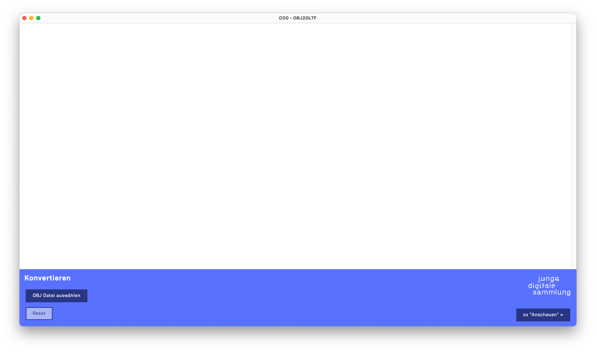

# O2G - OBJ to GLTF/GLB

## Inhaltsverzeichnis

1. [Kurzbeschreibung](#1-kurzbeschreibung)
2. [Finanzierung](#2-finanzierung)
3. [Voraussetzungen und Skills](#3-voraussetzungen-und-skills)
4. [Installation](#4-installation)
5. [Entwicklung](#5-entwicklung)
6. [Benutzung/Usage](#6-benutzungusage)
7. [Beteiligung/Contributing](#7-beteiligungcontributing)
8. [Credits](#8-credits)
9. [Lizenz](#9-lizenz)

## 1. Kurzbeschreibung

Das Deutsche Auswandererhaus ist ein kulturhistorisches Museum zum Thema Migration in Bremerhaven. Im Rahmen des deutschlandweiten Förderprojekts »museum4punkt0« sollen neue Formen der digitalen Kommunikation, Partizipation, Bildung und Vermittlung in Museen entwickelt, umgesetzt und evaluiert werden. Das Projektteam des DAHs erarbeitete unter dem Titel »Junge Digitale Sammlung« JDS ein museumspädagogisches Workshop-Angebot für Schulklassen. Der Workshop setzt sich inhaltlich mit den Themenkomplexen Identität und Diversität auseinander sowie mit der Bedeutung und Handhabung von Objekten im Museum. Teilnehmende Schüler:innen können dabei ihre Alltagsobjekte, die sowohl physisch als auch digital sein können, in 3D scannen oder fotografieren. Diese und weitere Daten zum Objekt werden in eine Datenbank eingegeben und später auf einer Plattform veröffentlicht. Durch die Workshops wird die JDS zu einer umfangreichen Sammlung anwachsen.

> Electron-Anwendung für die Umwandlung von OBJ zu GLTF/GLB Modellen inkl. DRACO komprimierter Version und Vorschaubild. Diese Anwendung ist im Rahmen der JDS-Web-Platform entstanden. Die Dateien, die Sie damit generieren, können Sie auf die JDS-Platform hochladen (s. bitte [JDS-Dokumentation](https://github.com/museum4punkt0/junge-digitale-sammlung)).

## 2. Finanzierung

Diese Anwendung ist entstanden im Verbundprojekt museum4punkt0 – Digitale Strategien für das Museum der Zukunft, Teilprojekt Deutsches Auswandererhaus – Migrationsgeschichte digital erleben. Das Projekt museum4punkt0 wird gefördert durch die Beauftragte der Bundesregierung für Kultur und Medien aufgrund eines Beschlusses des Deutschen Bundestages.

Weitere Informationen: https://www.museum4punkt0.de


## 3. Voraussetzungen und Skills

Für die Weiterentwicklung und/oder Anpassungen der Anwendung wird Personal mit guten Kenntnissen in JavaScript, HTML und CSS benötigt. O2G ist eine Electron-App:

> Durch die Einbettung von Chromium und Node.js in seine Binärdatei ermöglicht Ihnen Electron, eine JavaScript-Codebasis zu verwalten und plattformübergreifende Apps zu erstellen, die unter Windows, macOS und Linux funktionieren – es ist keine native Entwicklungserfahrung erforderlich.

Bevor Sie beginnen, stellen Sie sicher, dass Sie die folgenden Anforderungen erfüllt haben:

* npm ist auf Ihrem Rechner installiert.
* Optimalerweise stehen Ihnen OBJ-Dateien zur Verfügung, die mit einem 3D-Scanner erstellt wurden. Die Modelle sollten in der OBJ-Datei schon im 3D-Ursprung der Szene liegen (0/0/0), da sonst Drehungen beim Editieren umständig werden können.

## 4. Installation

```
npm install
````

## 5. Entwicklung

Es gibt 3 wichtige Befehle:

***Anwendung starten***

```
npm run start
````

***Anwendung verpacken***

```
npm run package
````

(Zielplattform = Entwicklungsplattform)

```
npm run package -- --platform win32
````

(Zielplattform selber definieren, z. B. wenn man an macOS für Windows exportiert.)

***Anwendung für Distribution verpacken***

```
npm run make
````

(Da die Anwendung für interne Zwecke benutzt wird, reicht `npm run package` , da wir sie nicht in App Stores hochladen werden. So entfällt das Signieren der App).

Für weitere Infos über Electron bitte die Dokumentation lesen:
https://www.electronjs.org/de/docs/latest

## 6. Benutzung/Usage

Die Anwendung ist recht einfach in der Handhabung. Sie besitzt 2 Modi: 'Konvertieren' und 'Anschauen'.

### Konvertieren

In 'Konvertieren' können Sie Ihre OBJ-Dateien in GLB (etwas bessere Qualität, größere Datei) und GTLF DRACO (etwas komprimiertere Version, kleinere Dateigröße) konvertieren. Beide Varianten werden immer exportiert, damit Sie selber entscheiden können, welche Datei ein gutes Qualität-Dateigröße-Verhältnis hat. Auch eine Bildvorschau/ein Platzhalter des Objekts wird exportiert. Dieses Bild erscheint in der JDS-Plattform während des Ladens des 3D-Modells, da die 3D-Dateien etwas groß sein können.

Man selektiert eine OBJ-Datei, die dann automatisch geladen und in ein temporäres GLTF-Modell konvertiert wird. Diese temporäre Datei wird auf dem Desktop in dem Ordner `O2G-temp` gespeichert. Dieser Ordner und seine Inhalte werden beim Beenden der App wieder gelöscht.

*Hinweis: Falls Sie nur selten mit OBJ-Dateien gearbeitet haben: sie bestehen aus mehreren Dateien - die eigentlichen 3D-Daten (.obj) und 2 Dateien für Texturierung (.mtl und .jpg). Bitte unbedingt aus Ihrem 3D-Tool nur Dateien mit Namen ohne Leerzeichen exportieren. Die Namen werden in der OBJ-Datei fest reingeschrieben und können nachträglich nur kompliziert geändert werden. O2G geht davon aus, dass die Namen keine Leerzeichen beinhalten werden.*

Start-Ansicht  |  OBJ-Datei öffnen
:-------------------------:|:-------------------------:
  |  

Wenn das GTLF-Modell im Viewer geladen wurde, können wir es editieren. Wenn man auf 'Editieren' klickt, erscheinen die dafür vorgesehenen Regler. Man kann das Objekt dreidimensional drehen, also um die X-, Y- und Z-Achse, und die Belichtung anpassen.

Temp. GLTF generiert und geladen | Editieren
:-------------------------:|:-------------------------:
 | 

Drehung editieren | Belichtung editieren
:-------------------------:|:-------------------------:
 | 

Bitte dabei beachten, dass falls Ihre OBJ-Modelle nicht im Ursprung der 3D-Szene liegen (Koordinaten 0/0/0), die Drehungen trotzdem um den Ursprung erfolgen. Das bedeutet, dass das Objekt aus der Szene rausfliegen wird. Kurz danach wird das Objekt aber automatisch wieder neu zentriert. Je nach Entfernung zum Ursprung wird dies stärker oder schwächer vorkommen. Die exportierten Objekte (GLB/GLTF-Dateien), die man in der JDS-Sammlung oder unter 'Anzeigen' betrachten kann, werden sich allerdings um sich selbst drehen, also sich 'richtig' drehen. OBJ-Dateien, die auf dem Ursprung liegen, erleichtern aber die Arbeit immens, da sich die Drehungen beim Editieren natürlich anfühlen und man das Objekt immer sehen kann.

Fertig editiert  |  Exportieren der einzelnen Dateien  |  'Tagesordner'
:-------------------------:|:-------------------------:|:-------------------------:
  |    |  

Wenn man zufrieden mit den Einstellungen ist, kann man auf 'Dateien generieren' klicken, um die GLB-, GLTF- und PNG-Dateien zu speichern. Bei diesem Schritt geht das System folgendermaßen vor:

* Falls es das erste Objekt an dem heutigen Tag ist, wird ein Ordner `{Datum}-JDS`erstellt, also z. B. `20230423-JDS`. Alle Objekte, die Sie an dem Tag exportieren, werden hier gespeichert.

* Der 'Tagesordner' hat einen Unterordner `upload_erledigt`. Diesen Ordner können Sie nutzen, um Dateien, die Sie schon auf die JDS-Platform hochgeladen haben, zu sortieren. So behalten Sie einen besseren Überblick.

* Die Dateien, die generiert werden, haben ein Präfix mit einer Uhrzeit und ein Suffix mit der Belichtung (Exposure). Wichtig! Die Uhrzeit bezieht sich auf den Moment des Ladens der OBJ-Datei, nicht des Exports! Wann die Datei erstellt wurde, können Sie ja immer in den Dateiinformationen sehen (z. B. im Windows-Explorer oder Mac-Finder). Die Namen sehen wie folgt aus: `{Uhrzeit}_{originalname}--{TYP}_&_exp={Wert der Belichtung}`, z. B. `083837_Reisepass--COMP_&_exp=1`. Der Typ dient als extra Beschriftung: NORM (normale GLB), COMP (komprimierte DRACO GLTF) und PREVIEW (PNG-Bild). Die Exposure (exp) benötigt die JDS-Plattform, um die richtige Belichtung auf der Sammlungsseite des Objekts einzustellen, da die Belichtung leider nicht in der Datei selbst gespeichert werden kann. **WICHTIG**: Somit sollten Sie bitte diese Dateien nicht umbenennen, da anhand der Namen einige automatische Prozesse in der JDS-Plattform ausgeführt werden.

Mit 'Reset' werden die Inhalte im Viewer gelöscht.

### Anschauen

Hier können Sie GLB- oder GLTF-Dateien per Drag-and-Drop laden (mehrere gleichzeitig möglich) und sie per Maus frei drehen, so wie es auf der JDS-Plattform auch sein wird. Hier werden Ihnen auch die Dateigrößen angezeigt, damit Sie sich zwischen GLB oder GLTF entscheiden können.

Mit 'Reset' werden die Inhalte im Viewer gelöscht.

'Anschauen'-Modus | 
:-------------------------:|
 | 

## 7. Beteiligung/Contributing

Wenn Sie etwas beitragen möchten, forken Sie bitte das Repository und verwenden Sie einen Feature-Fork.  Pull Requests sind herzlich willkommen.

## 8. Credits

Diese Anwendung ist entstanden im Verbundprojekt museum4punkt0 – Digitale Strategien für das Museum der Zukunft, Teilprojekt Deutsches Auswandererhaus - Migrationsgeschichte digital erleben. Weitere Informationen: https://www.museum4punkt0.de.

Das Projekt museum4punkt0 wird gefördert durch die Beauftragte der Bundesregierung für Kultur und Medien aufgrund eines Beschlusses des Deutschen Bundestages.

Auftraggeber und inhaltliches Konzept: Deutsches Auswandererhaus Bremerhaven, Columbusstraße 65, 27568 Bremerhaven

Design: Andreas Heller Architects and Designers, Hamburg

Auftragnehmer Programmierung: 2av GmbH, Keltergasse 3, 89073 Ulm, Ansprechpartner: Jens Döring (Projektkoordination), Santiago Duque (Projektleitung und Entwicklung)

## 9. Lizenz

GNU GENERAL PUBLIC LICENSE 
Copyright © 2022/2023, Deutsches Auswandererhaus / Design: Andreas Heller Architects and Designers, Hamburg; Programmierung: 2av GmbH, Ulm.
Please also see the LICENSE file provided within this repository.

